# CookBook
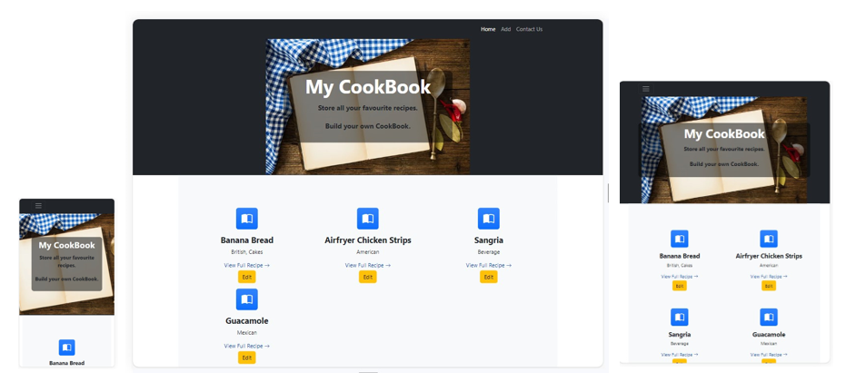

(Developer: Mair Edmunds)

Cookbook is an online web application that allows users to easily access new cooking recipes. It also has an admin feature to register and login to enable the admin user to add, edit and delete recipes. 
The site has a simple and easily navigated interface, allowing the user to quickly fulfil their customer needs.

[View Live Site Here](https://cook-book-2d3eb6c90320.herokuapp.com/)

## Table of Contents (Update layout to click to expand)
-   [UX](#ux)
    -   [Goals](#goals)
    -   [User Stories](#user-stories)
    -   [Design](#design)
        -   [Wireframes](#wireframes)
        -   [Data Design](#data-design)
        -   [Visual Design](#visual-design)
            -   [Colours](#colours)
            -   [Fonts](#fonts)
            -   [Icons](#icons)
-   [Features](#features)
    -   [Current Features](#current-features)
        -   [Page Features Matrix](#page-features-matrix)
        -   [User Feature Permissions](#user-features-permissions)
    -   [Future Features](#future-features)
-   [Languages and Technologies](#languages-and-technologies)
    -   [Languages](#languages)
    -   [Frameworks](#frameworks)
    -   [Libraries](#libraries)
    -   [Platforms](#platforms)
    -   [Other Tools](#other-tools)
-   [Testing](#testing)
    -   [Methods](#methods)
    -   [Bugs](#bugs)
        -   [Fixed Bugs](#fixed-bugs)
        -   [Unfixed Bugs](#unfixed-bugs)
-   [Deployment](#deployment)
    -   [Live Deployment](#live-deployment)
    -   [Local Deployment](#local-deployment)
        - [Github Instructions](#github-instructions)
    -   [Requirements and env](#requirements-and-env)
    -   [Relational database](#relational-database)
    -   [Heroku](#heroku)
-   [Credits](#credits)
    -   [Code Credits](#code-credits)
    -   [Support Credits](#support-credits)
    -   [Contact](#contact)

    ## UX
    
    ### Goals
    The target audience for CookBook are:
    - People interested in building their own collection of recipes.

    User goals are:
    - Easily work out the purpose of the website.
    - Easily navigate the website..
    - User has the ability to add/edit and delete recipes..  
    - Contact the website admin.

    CookBook fills these needs by:
    - Each page has a header with the title and cookbook image so it is asy to understand the focus of the website.
    - There is a fixed navigation bar at the top of each page to direct the user as well as buttons in the body of the page to go back and forth.
    - User has access to the Addrecipe page aswell as edit button which enables them to edit and delete a recipe.
    - Providing a contact form as well as links to social media of the admin user, myself.

    ### User stories

    1. User -
    - I want to get to understand the main purpose of the site.
    - I want to build my own recipe colelction to make a cookbook/
    - I want to be able to contact the owner with any suggetsions to update the site.

    2. Website owner
    - Provide a welcoming, interactive.

    ### Design

    ### Wireframes
    I created wireframes to assist me when building my HTML page layout for displaying on a Desktop, mobile and tablet.

    

Home Page

    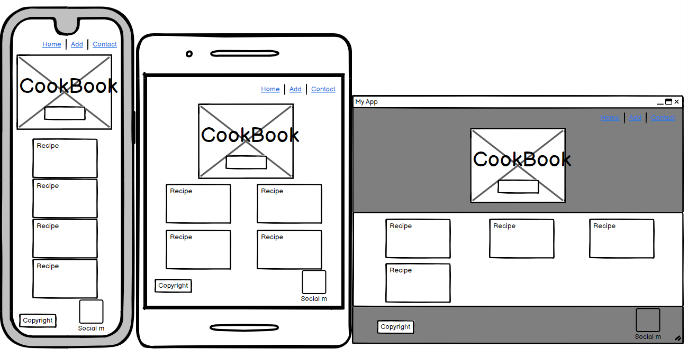
    

    

Add

    
    

    

Edit

    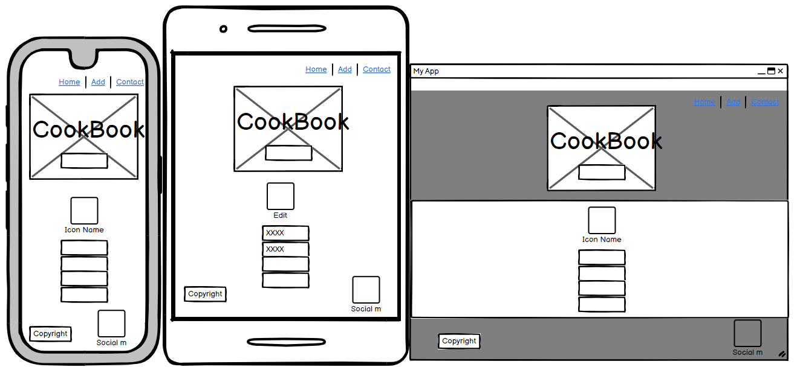
    

    

Delete

    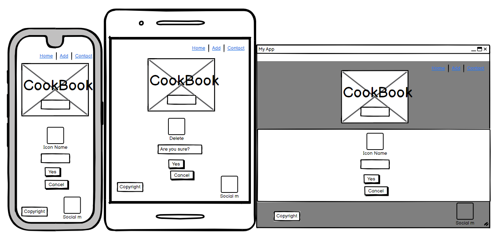
    

    

Contact Us

    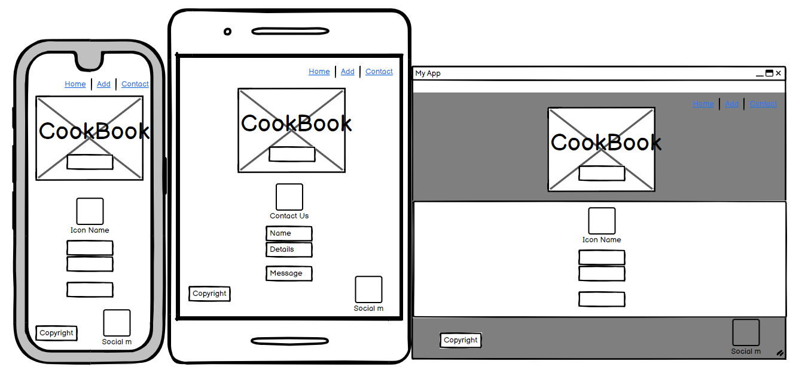
    

    
    ### Data Design
    This project uses relational database, meaning each collection is directly related to one another. 

    CRUD has been implemented as following:
    1. Create
    * User can create and add their own recipes.

    2. Read
    * Recipes added by users can be easily viewed.

    3. Update
    * User can edit recipes to correct any errors or to make improvements.

    4. Delete
    * Users can delete their added recipe.

    ### Visual Design
    #### Fonts
    Example
    - The primary font...
    - The secondary font...

    #### Icons
    Image
    - Icons are taken from the [getbootstrap](https://icons.getbootstrap.com/i) anf [favicon](https://favicon.io/) Icon library and are utilised as classes in the `<i>` tag.
    - As they are utilised as classes, they can easily be styled using other classes or IDs in the same tag. I often used Bootstrap classes to style them uniformly.
    - I have used the instagram, facebook, twitter and linked in icons in the footer. These direct you to the main home pages but ideally the owner would have profiles on each one.
    - Each page has a simple icon above its title to give a pictorial idea of what the page's use is.

    #### Colours
    Colour scheme image
    I chose a very simple colour scheme with a dark header and light body to allow the user to read and navigate the site without being distracted by lots going on.

    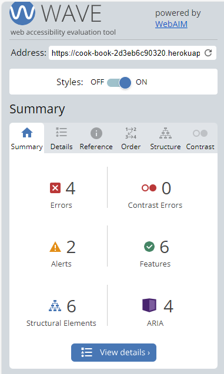
    I used wave to check my accessibility and confirm my colour scheme. It alerted me to 4 warnings but on closer look, these were incorrect.
    
    ----

    ## Features
    ### Current Features
    #### Page Features Matrix
    
    Informs the user the purpose othe site and displays a summary of all the recipes in the complete cookbook.

    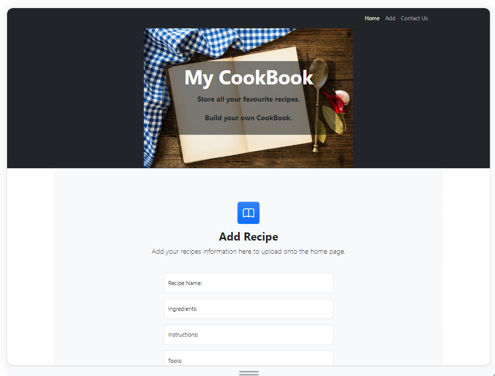
    Contains the relevant fields in a form for the user to add all information needed in a recipe.

    
    Contains the relevant fields nin a form for the user to confirm the entered text is correct/update as required.

    
    Gives the user the option to delete a particular recipe.

    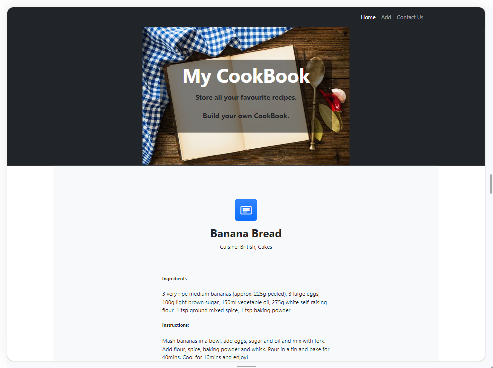
    Contains all information about each recipe.

    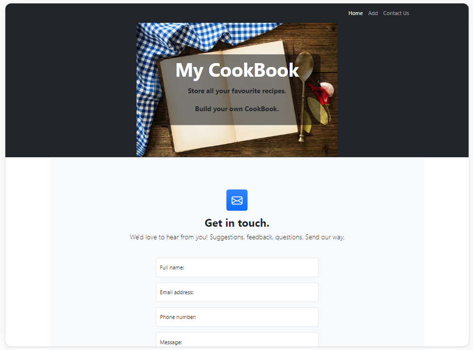
    Gives the user the opportunity to contact the owner to ask questios or suggets improvement to the site.

    
    I chose to use s defult 404 page as it is very simple and clear so already follows the structure of my website pages.

    The navbar, header and footer are consistent over each page.

    #### User Feature Permissions

    ### Future Features
    To improve my CookBook page further I could:
    - Add customised images to the index page for recipes.
    - Add a search function using the recipe cuisine type.
    ----

    ## Languages and Technologies

    ### Languages
    - [HTML](w3.org/standards/webdesign/htmlcss)
        * Page markup.
    - [CSS](w3.org/standards/webdesign/htmlcss)
        * Styling.
    - [Javascript](https://developer.mozilla.org/en-US/docs/Web/JavaScript)
        * Running functions for interactive components, etc.
    -[Python]
        *Flask and SQL to create a database.

    ### Frameworks
   I build my framework using Bootstrap CSS, SQLAlchelmy, SQLite, Gitpod, Github, Heroku and Flask.

    ### Libraries
    - [Google Fonts](https://fonts.google.com)
        * Font Styles.

    ### Platforms
    - [Github](https://github.com/)
        * Storing code remotely and deployment.
    - [Gitpod](https://gitpod.io/)
        * IDE for project development.
    -[Heroku](https://www.heroku.com)
        * Platfom to deploy as a url.

    ### Other Tools
    - [Balsamiq](https://balsamiq.com/)
        * To create wireframes.
   
    ----

    ## Testing
    Testing can be conducted either manually or automated and each has its own pros and cons.
    - Manual
        Pros
        - Simpler. Less training and program knowledge is required.
        - User testing. Performed by humans so helps in usability testing.
        Cons
        - Time. Can take a lot of time up.
        - People. Requires people resource as complete by the tester/developer.
        - Limited. Errors may be missed as human error will come into it.

        Manual testing is used for low volume, exploratory testing where the deveoper wants to test the usability.

    - Automated
        Pros
        - Quicker. Hundreds of tests can run in a short space of time.
        - Efficient. Helps detect errors earlier as written before the software.
        - Specific. Edge cases can be accounted for.
        - Reliable. Results are accurate and repeatable.
        Cons
        - Limited. Only as good as the questions we ask.
        - Function Only. Doesn't test the User Stories.

        Automated Testing is use for high volume, repeatable testing to test performance.

    I have chosen to primarily use manual testing for my web page.

    ### Methods
    Validation.
    All pages wwere tested with no errors for the following:
    - [HTML](https://validator.w3.org/nu/) All pages bassed through HTML validation. Warnign highlighter for using {{ url_for() }} but this is allowed as part of flask template.
    - 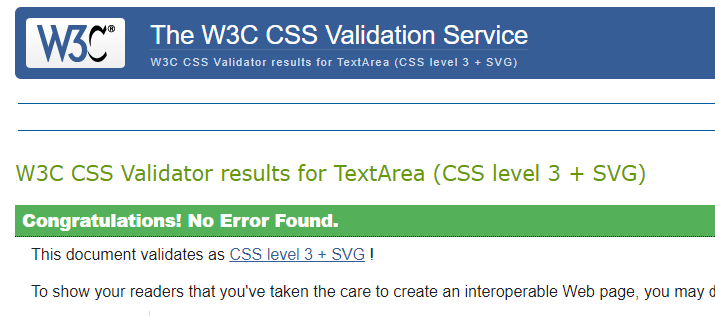
    - Links - All links tested and take you to the correct pages.
    - Javascript - Passed through jsfiddle with no issues.
    - 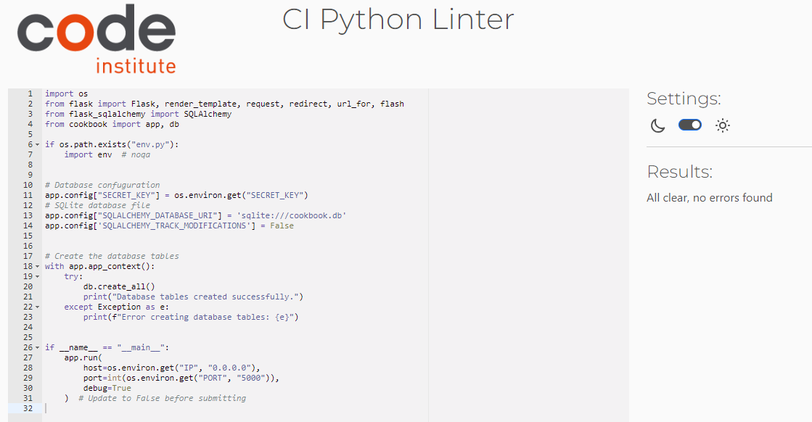
    
    General Testing

    Here is a table of the manual testing done on the site to determine if all features work as described and designed:

    |Feature Tested|Required Action|Expected Outcome|Result|
    |---|---|---|---|

    Mobile Testing
    Desktop Testing

    User Stories Testing

    |User Story|Screenshot|
    |---|---|

    Lighthouse Testing
    ||
    ||

    ### Bugs
    1.The collapsed nav bar is not expanding on smaller screens.
    2.
    3.

    #### Fixed Bugs
    1. T
    2.
    3.

    #### Unfixed Bugs
    1.

    ----

    ## Deployment
    ### Live Deployment
    The site was deployed to [Heroku](https://www.heroku.com/platform). [View Live Site Here](https://cook-book-2d3eb6c90320.herokuapp.com/)

    ### Local Deployment
    To access this [GitHub Repository](https://github.com/Mair-E/MilestoneProject3) locally, you can follow the below guides to either clone or fork the repo.
    **Requirements:**

    - An IDE of your choice, such as Gitpod, which can be accessed through [GITHUB]( https://github.com/).
    - A free GitHub account.

        #### Github Instructions
    1. Log in to your GitHub account.
    navigate to [https://github.com/Mair-E/MileStoneProject2](https://github.com/Mair-E/MileStoneProject2).
    1. You can set up your own repository and copy or clone it, or you fork the repository.
    2. `git add`, `git commit` and `git push` to a GitHub repository, if necessary.
    3. GitHub pages will update from the master branch by default.
    4. Go to the **Settings** page of the repository.
    5. Scroll down to the **Github Pages** section.
    7. Select the Master Branch as the source and **Confirm** the selection.
    8. Wait a minute or two and it should be live for viewing. See my own [here]( https://mair-e.github.io/MileStoneProject2/)

    ### Requirements and env
    ### Relational database

    ### Heroku
    1. Type `pip3 freeze --local > requirements.txt` into the Gitpod terminal to create a requirements.txt file.
    2. Type `echo web: python app.py > Procfile` into the terminal to create a Procfile.
    3. Commit and push the changes to Github.
    4. Login to your Heroku Account.
    5. Click 'New' -> 'Create new app'.
    6. Enter a name for your project and select your region.
    7. Click 'Create app'.
    8. Go to 'Settings', click 'Reveal Config Vars'.
    9. Add the following variables:
        * DATABASE_URL: your SQLite database url
        * IP: 0.0.0.0
        * PORT: 5000
        * SECRET_KEY: your secret key
        * DEBUG: True
    10. Click on the 'Deploy' tab.
    11. Click 'Connect to Github'.
    12. Find your depo and click 'Connect'
    13. Click 'Deploy Branch'.
    14. Click 'More' -> 'Run console'
    15. Type in `python3`
    16. Type `from cookbook import db` -> `db.create_all()` -> `exit().`
    17. Click 'Open App'.

    ----

    ## Credits
    ### Code Credits
    All page code wa hand written using guidance from various resourtces listed below:
    - Codeinstitute lesson.
    - [Bootstrapstart](https://github.com/StartBootstrap/startbootstrap-business-frontpage) basic webpage template.

    ### Support Credit
    - Rory my mentor for guideing me.
    - [Slack](https://slack.com/intl/en-gb/) to searching for ideas for inspiration.
    - [Google](https://www.google.com/) trouble shouting when stuck.
    - [Flask-SQLAlchemy](https://pypi.org/project/Flask-SQLAlchemy/)with assistance adding 
    
    All images were taken from the sites below:
    - [istockphoto](https://www.istockphoto.com/photos/feast) for index.html image of feats used above all recipes.
    - [Favicon](https://favicon.io/) for the Favicon for the website.

    ### Contact
    Please feel free to contact me at `xmairx@hotmail.co.uk`